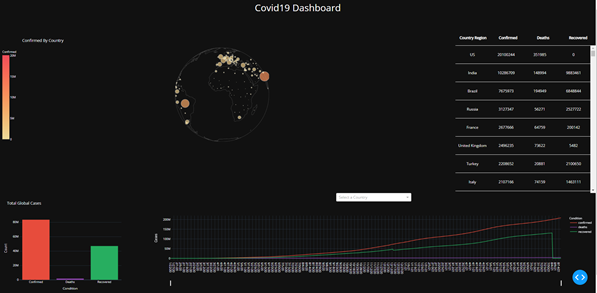
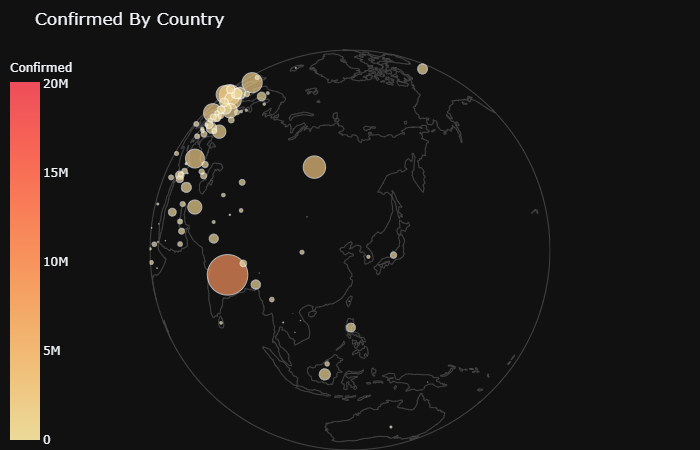
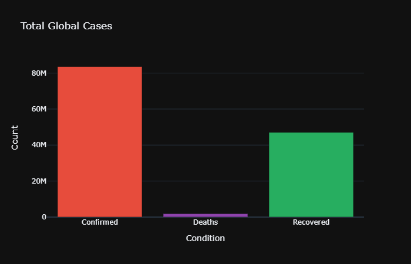
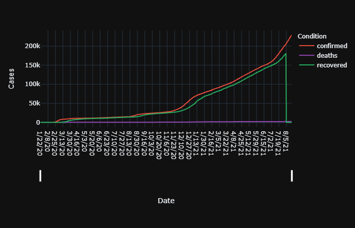

# Covid19 Dashboard

## How to Implement?
Need to install virtualenv, pandas, dash

    $ git clone https://github.com/hanwoolsky/covid19.git
    $ virtualenv env
    $ source env/bin/activate
    $ which python
    [path]/python
    $ source [path]/activate
    $ export VIRTUALENVWRAPPER_PYTHON=$(which python3)
    $ source /usr/local/bin/virtualenvwrapper.sh
    $ mkvirtualenv (name)
    $ workon (name)
    $ python main.py

## Content(~21/08)
1. Overall Dashboard

2. Comfirmed by country with Bubble Map

3. Total Gloabal Cases with Bar Chart

4. Cases of Each Country with Line Chart

## Reference
> Data Source - https://github.com/CSSEGISandData/COVID-19

> Dash Tutorial - https://dash.plotly.com/